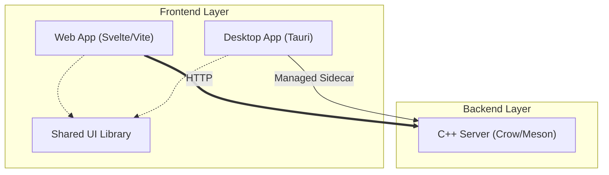

# Lunatix Starter Proj

A high-performance monorepo boilerplate combining the speed of C++ backends with the flexibility of Svelte-based frontends.

---

## Architecture Overview

This project uses a monorepo structure to share components across web and desktop targets while maintaining a high-performance native core.



### Component Breakdown
- **`apps/web-app`**: A modern Svelte application built with Vite.
- **`apps/desktop-app`**: A Tauri-powered desktop shell for the web application.
- **`apps/shared-ui`**: A centralized library of Svelte components used by both web and desktop.
- **`cpp-server`**: A high-performance C++ backend using the Crow framework.

---

## Quick Start

The easiest way to get started is to use the integrated installation script:

```bash
chmod +x install.sh
./install.sh
```

This will verify your dependencies, install all necessary packages, configure the build environment, and compile the project.

---

## Manual Setup & Development

### 1. Verification & Configuration

Verify you have all required development tools:
```bash
bun run check-deps
```

Initialize your build environment using one of the presets defined in `build-config.json`:
```bash
bun run config:debug    # For development (default)
bun run config:release  # For production builds
```

### 2. Running the Application

Use the `start.sh` script (or `bun run start:*` shortcuts) to launch different components:

| Command | Description |
|---------|-------------|
| `./start.sh web` | Starts the Svelte web application |
| `./start.sh desktop` | Starts the Tauri desktop application |
| `./start.sh server` | Starts only the C++ backend |
| `./start.sh desktop:standalone` | Starts desktop app with managed C++ sidecar |

### 3. Utility Commands

| Command | Description |
|---------|-------------|
| `bun run clean` | Removes all build artifacts, `node_modules`, and temporary files |
| `bun run check-deps` | Verifies system dependencies |

### 4. Building for Production

To perform a complete build of the entire stack for distribution:
```bash
bun run build:all-release
```

Or use the `build.sh` script directly for more control:
```bash
./build.sh --release --standalone
```

---

## Configuration Management

Project-wide settings are centralized in **`build-config.json`**:

- **`server`**: Control the C++ compiler (`clang++` vs `g++`), C++ standard, and Meson build arguments.
- **`desktop`**: Manage environment variables (like `WEBKIT_DISABLE_DMABUF_RENDERER`) for the Tauri shell.
