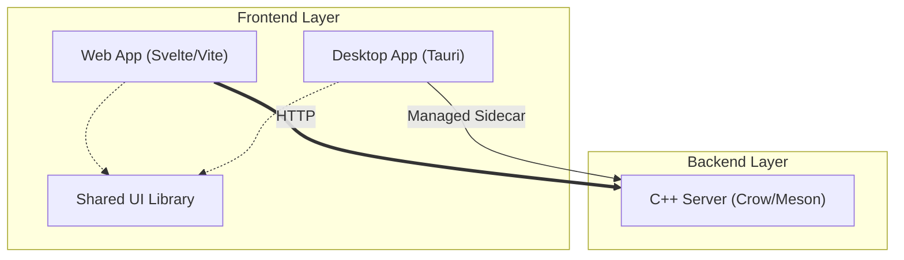

# Lunatix Starter Proj

A high-performance monorepo boilerplate combining the speed of C++ backends with the flexibility of Svelte-based frontends.

---

## 🏗️ Architecture Overview

This project uses a monorepo structure to share components across web and desktop targets while maintaining a high-performance native core.



### Component Breakdown
- **`apps/web-app`**: A modern Svelte application built with Vite.
- **`apps/desktop-app`**: A Tauri-powered desktop shell for the web application.
- **`apps/shared-ui`**: A centralized library of Svelte components used by both web and desktop.
- **`cpp-server`**: A high-performance C++ backend using the Crow framework.

---

## 🚀 Getting Started

### 1. Verify Dependencies
Run the automated dependency checker to ensure you have all required development tools (Bun, Node, Meson, Ninja, Rust, C++23):

```bash
bun run check-deps
```

### 2. Configure the Backend
The C++ server uses a centralized configuration system. Initialize your build environment using one of the presets defined in `build-config.json`:

```bash
bun run config:debug
```

### 3. Run the Application

#### Web Only
```bash
bun run start:web
```

#### Desktop (with Managed Sidecar)
To run the desktop app and have Tauri automatically manage the C++ server life-cycle:
```bash
bun run start:desktop:standalone
```

---

## 🔧 Configuration Management

Project-wide settings are centralized in **`build-config.json`**:

- **`server`**: Control the C++ compiler (`clang++` vs `g++`), C++ standard, and Meson build arguments.
- **`desktop`**: Manage environment variables (like `WEBKIT_DISABLE_DMABUF_RENDERER`) for the Tauri shell.

---

## 🛠️ Build Workflows

### Full Release Pipeline
To perform a complete build of the entire stack for distribution:
```bash
bun run build:all-release
```

### Manual Server Build
```bash
# Update configuration
bun run config:release

# Compile
bun run build:server
```
